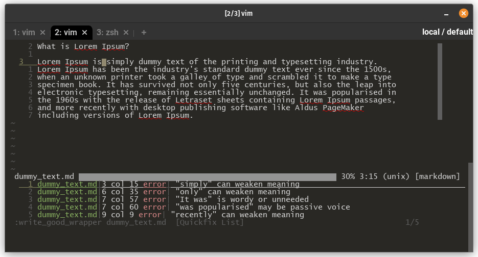

# write_good_wrapper

Wrapper of the `write-good` command for Vim's Quickfix / `makeprg`.    
Inspired by [vim-writegood](https://github.com/ubaldot/vim-writegood)

<p align="center">
  
</p>

#### Raw output
```shell
λ write_good_wrapper write_good_wrapper/dummy_text.md
write_good_wrapper/dummy_text.md:3:15:e:"simply" can weaken meaning
write_good_wrapper/dummy_text.md:6:35:e:"only" can weaken meaning
write_good_wrapper/dummy_text.md:7:57:e:"It was" is wordy or unneeded
write_good_wrapper/dummy_text.md:7:60:e:"was popularised" may be passive voice
write_good_wrapper/dummy_text.md:9:9:e:"recently" can weaken meaning
```

## Requires
The CLI of [write-good](https://github.com/btford/write-good#cli) *(npm)*

## Installing
1. Place `write_good_wrapper` into a bin, like `~/.local/bin/`
2. make executable with `chmod +x write_good_wrapper`

## Vim Configuration
It's recommended to create an `ftplugin` for the specific filetypes that you want
this command available in.

#### Example, Markdown `~/.vim/ftplugin/markdown.vim`
```vim
setlocal makeprg=write_good_wrapper\ %:S
setlocal errorformat=%f:%l:%c:%t:%m
```

## Use
Run `:make` and the Quickfix buffer will appear with errors, if they exist.    
    
Map example:
```vim
nnoremap <leader>mf :silent make<CR>:redraw!<CR>
```


## Recommendations
1. [vim-qf](https://github.com/romainl/vim-qf) is a great starting point for using the Quickfix and Location List
2. [vim-grepper](https://github.com/mhinz/vim-grepper) is a file searcher that can use either the Quickfix or Location List

## License
Vim License
